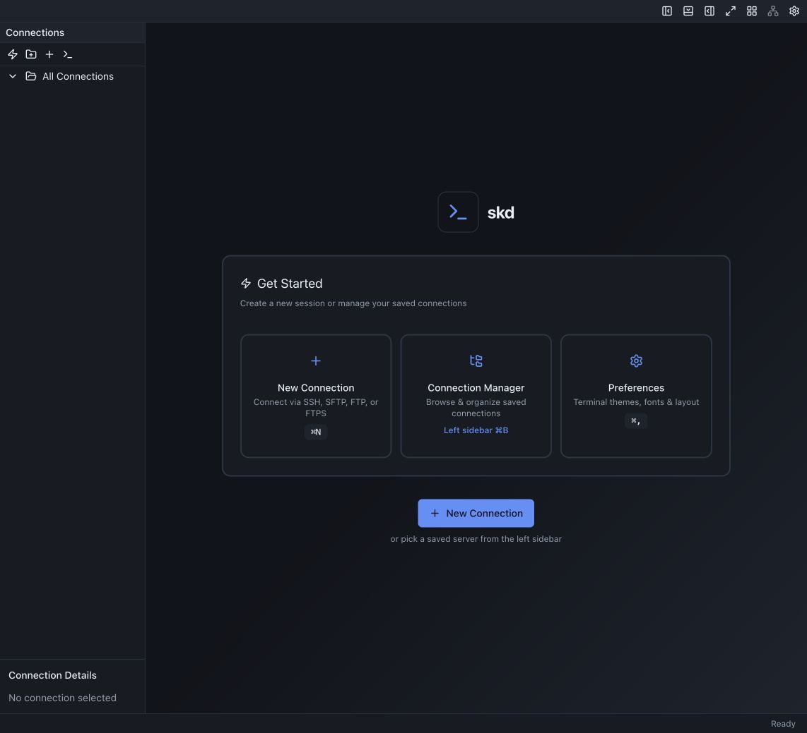
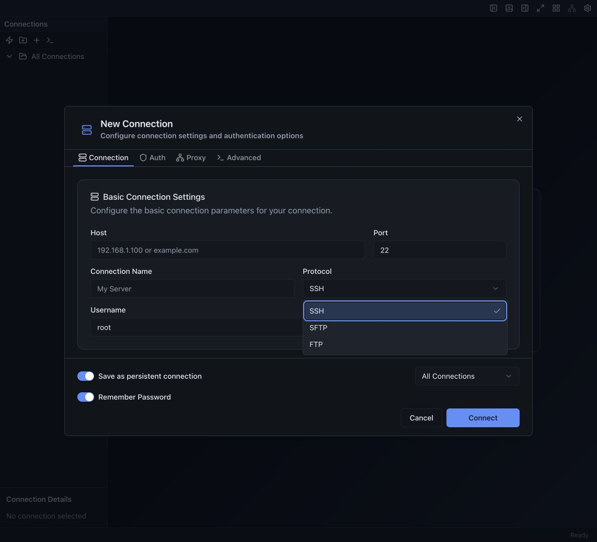

<p align="center">
  
</p>

<h1 align="center">skd</h1>

<p align="center">
  A lightweight macOS workspace for SSH terminals, local shells, and remote file work.
</p>

<p align="center">
  <a href="https://github.com/LeeSpo/skd/actions/workflows/ci.yml"></a>
  <a href="https://github.com/LeeSpo/skd/releases/latest"></a>
  
  <a href="LICENSE"></a>
</p>

> [!WARNING]
> skd is built for macOS only; it can connect to SSH hosts running any operating system. The application interface is currently English-only.

## Overview

skd brings interactive SSH sessions, local shells, SFTP file management, and saved connection profiles into a single desktop workspace. It is intended for people who regularly move between terminal work and remote files and prefer a lightweight native macOS application over a browser-based console.



## Highlights

- **Terminal workspace** — Run local shells and interactive SSH PTY sessions in tab groups. Split panes, move tabs between groups, search terminal output, and drag files or folders into a terminal with POSIX-safe path escaping.
- **SSH connections** — Connect with passwords, private keys, or keyboard-interactive authentication. HTTP, SOCKS4, and SOCKS5 proxies are supported.
- **Host-key verification** — Unknown SSH host keys are presented for an explicit trust decision and are saved in skd's own `known_hosts` store.
- **File work** — Browse local and remote directories side by side, upload and download files or directories, rename and delete entries, and track transfers. The file panel can follow supported shell working-directory updates.
- **Connection organization** — Keep non-secret connection profiles in a folder-based sidebar. Passwords, private-key content, and passphrases are stored through the macOS Keychain.
- **Port forwarding** — Create OpenSSH-style local forwards, save bookmarks, test remote targets, and see listener/target health.
- **Useful extras** — Edit supported remote text files with CodeMirror, choose terminal and application themes, and add optional remote system-monitor panels.
- **Compatibility** — Standalone SFTP is supported. FTP and FTPS remain available for compatibility, but they are not the primary focus of the project.



## Download and install

Download the appropriate DMG from the [latest GitHub Release](https://github.com/LeeSpo/skd/releases/latest):

| Your Mac | Release asset |
| --- | --- |
| Apple Silicon (M-series) | `skd_<version>_aarch64.dmg` |
| Intel | `skd_<version>_x64.dmg` |

1. Open the DMG and move `skd.app` to `/Applications`.
2. Open the app from `/Applications`.
3. Each release includes `SHA256SUMS`; verify the checksum when you need to validate a download.

> [!NOTE]
> Release builds are ad-hoc signed and are **not currently notarized by Apple**. macOS may block the first launch. After attempting to open the app, use **System Settings → Privacy & Security → Open Anyway** for a DMG obtained from this repository's official Release page. Do not bypass a security warning for an unverified download.

## Security and data handling

- Connection profiles and layout preferences stay on the local machine. Secret fields are kept separately in the macOS Keychain rather than exported with connection profiles.
- skd maintains its own application-specific `known_hosts` store; it does not use `~/.ssh/known_hosts`. Verify a new host fingerprint through an independent channel before trusting it.
- skd is not a replacement for a managed credential vault, endpoint security controls, or an audited enterprise SSH solution. Review the code and release checksums before using it with sensitive infrastructure.
- Never include passwords, private keys, passphrases, hostnames, or other secrets in GitHub issues or pull requests.

## Development

### Requirements

- macOS (Apple Silicon or Intel)
- Node.js 22+
- pnpm 9 (the repository pins `9.15.4`)
- Rust stable with Rust 1.85 or newer
- Tauri 2 dependencies for macOS

```bash
git clone https://github.com/LeeSpo/skd.git
cd skd
pnpm install --frozen-lockfile
pnpm tauri dev
```

`pnpm tauri dev` runs the complete desktop application. `pnpm dev` starts only the Vite frontend at `http://localhost:1420`; it does not provide Tauri commands, the macOS menu bar, Keychain access, local PTYs, or SSH/SFTP connections.

### Validate and build

```bash
# Frontend
pnpm lint
pnpm exec tsc --noEmit
pnpm test
pnpm build

# Rust backend
cd src-tauri && cargo test

# macOS .app and .dmg bundle
pnpm tauri build
```

GitHub Actions builds release DMGs for both Apple Silicon and Intel and publishes their checksums when a `v*` tag is pushed. See the [changelog](CHANGELOG.md) for release history.

## Built with

- [Tauri 2](https://tauri.app/), [Rust](https://www.rust-lang.org/), and [Tokio](https://tokio.rs/)
- [React](https://react.dev/), TypeScript, and Tailwind CSS
- [xterm.js](https://xtermjs.org/) for terminal emulation
- [`russh`](https://github.com/Eugeny/russh) and `russh-sftp` for SSH and SFTP
- [CodeMirror](https://codemirror.net/) for the remote text editor

## Contributing

Bug reports, feature requests, and pull requests are welcome. Please read [CONTRIBUTING.md](CONTRIBUTING.md) for setup, validation, coding conventions, and reporting guidance. Before filing an issue, remove all credentials and sensitive host details.

## Acknowledgements

skd began as a fork of [R-Shell](https://github.com/GOODBOY008/r-shell) by GOODBOY008. The upstream project is MIT licensed; its copyright and attribution are retained in [NOTICE](NOTICE).

## License

skd is released under the [MIT License](LICENSE).
